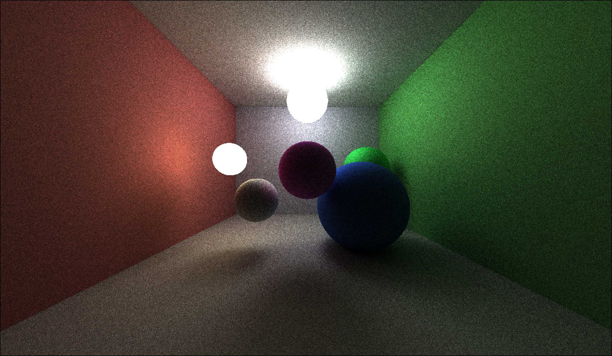

# Ray Tracer
A CPU-based ray tracer written in Rust with multithreading support.

## Prerequisites
- Rust (latest stable version)
- Cargo

## Installation
```bash
git clone https://github.com/nvimbtw/raytracer.git
cd raytracer
```

## Usage

Run the ray tracer:
```bash
cargo run --release
```
*Note: Use `--release` flag for optimized performance*

## Screenshots




